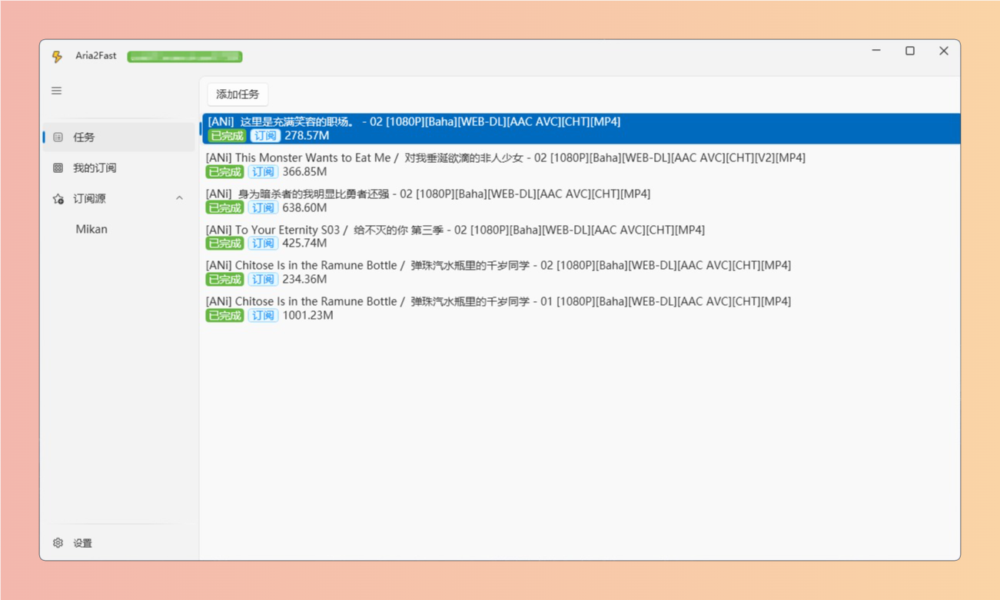
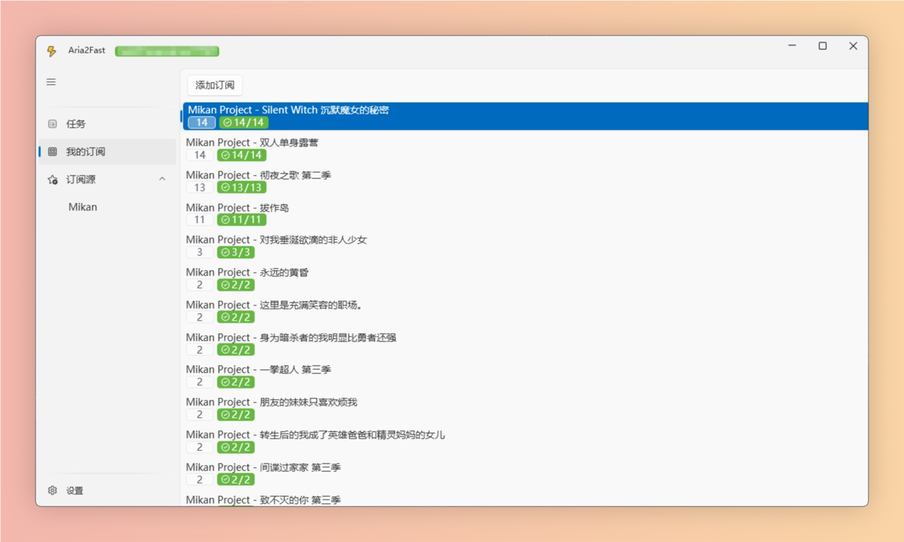
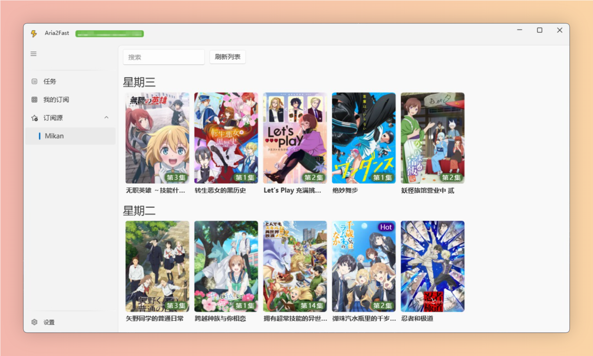
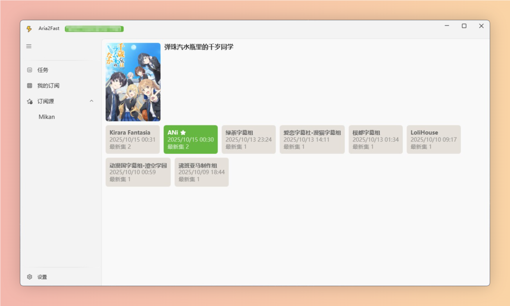
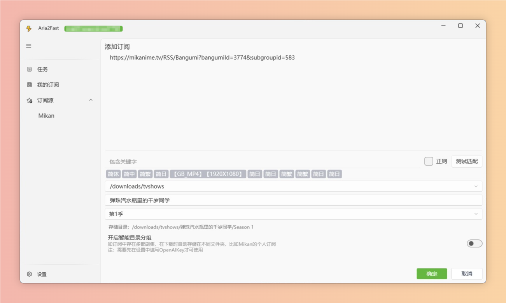



 

 
 

<h2 align="center">Aria2Fast</h2>

Aria2的Windows轻量下载客户端，支持BT、HTTP下载及动漫订阅，内嵌了 <a herf="https://mikanani.me/">Mikan</a> 快速动漫订阅添加 

## 功能
* ⭐任务批量添加
* ⭐支持订阅
* ⭐集成[Mikan](https://mikanani.me/)的动漫源，快速添加订阅
* ⭐可使用内嵌的Aria2下载，无需另外下载配置（当然也可支持远程RPC接口）。
* ⭐任务完成推送。
* ⭐单订阅文件多剧集AI拆分目录（实验性，需OPENAIKEY）
  
## UI截图

